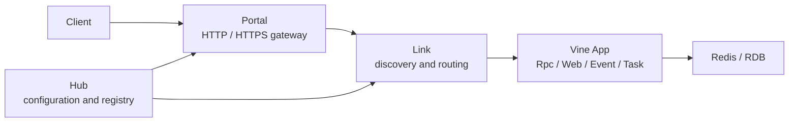

# Vine

[](LICENSE)
[](https://github.com/yorun-ai/vine/releases/latest)
[](go.mod)
[](https://github.com/yorun-ai/vine/actions/workflows/ci.yml)

**English** | [简体中文](README.zh-CN.md)

Vine is a runtime framework for Go applications. It brings application lifecycle, dependency injection, configuration, Rpc, Web, Event, Task, and infrastructure components into a unified application model. Hub, Link, and Portal let the same application move smoothly from single-process development to multi-process deployment.

> Vine is currently stabilizing its public API before 1.0. Minor releases may contain breaking changes, while patch releases remain backward-compatible within the same minor release line. The first public release starts at `v0.9.0`; historical internal versions are outside the public compatibility commitment.

## Features

- Unified application, component, and module lifecycles
- Go type-based dependency injection and execution scopes
- Type-safe Rpc, Web, Event, and Task contracts
- Integrated configuration, logging, Redis, and relational databases
- Standalone, linked, and separated deployment modes
- Service registration, discovery, and external gateways through Hub, Link, and Portal
- Go and TypeScript contract generation powered by skelc
- English and Chinese documentation

## Architecture



- **App** hosts business components, modules, and exposed capabilities.
- **Hub** manages configuration, service registration, and runtime state.
- **Link** connects applications to Hub and provides service discovery and request forwarding.
- **Portal** provides external HTTP, HTTPS, Rpc, and Web entry points.

For local development, standalone mode starts the complete runtime in one process. Deployments can separate Hub, Link, Portal, and business applications as needed.

## Get Started in 5 Minutes

Prerequisite: Go 1.26.5 or later.

```bash
mkdir vine-hello
cd vine-hello
go mod init example.com/vine-hello
go get go.yorun.ai/vine@v0.9.0
```

Create `main.go`:

```go
package main

import (
	"go.yorun.ai/vine/app"
	"go.yorun.ai/vine/app/standalone"
	"go.yorun.ai/vine/core/logger"
)

type HelloModule struct {
	app.BaseModule
}

func (*HelloModule) AfterAppStart() {
	logger.Info("hello from Vine")
}

type HelloApp struct {
	app.Application
}

func (*HelloApp) Name() string {
	return "demo.hello"
}

func (*HelloApp) InitModules(add app.TypeAdder) {
	add(app.T[*HelloModule]())
}

func main() {
	standalone.NewWithOption[*HelloApp](standalone.Option{
		SQLiteFile: "./vine.sqlite",
	}).StartAndWait()
}
```

Run the application:

```bash
go run .
```

When `hello from Vine` appears in the log, the complete standalone runtime and business application are running. Press `Ctrl+C` for graceful shutdown.

## Documentation

- [Getting started](https://yorun.ai/en/vine/getting-started)
- [Build your first application](https://yorun.ai/en/vine/tutorial-first-app)
- [Deployment modes](https://yorun.ai/en/vine/deployment-modes)
- [Framework package index](https://yorun.ai/en/vine/core-packages)
- [Documentation (Chinese)](https://yorun.ai/vine/)

The documentation site source is maintained in
[`yorun-ai/vine-doc`](https://github.com/yorun-ai/vine-doc). Preview the site from
a `vine-doc` checkout with:

```bash
cd vine-doc
pnpm install
pnpm start
```

## Security Status

> **TODO:** Add authentication and encrypted communication between Hub, Link,
> Portal, and application processes.

The embedded Hub Redis server currently allows password-free, read-only client
connections. It distributes runtime configuration, including Portal TLS private
key material. Until component authentication and transport encryption are
implemented, bind Vine's internal endpoints only to loopback or trusted private
networks, restrict them with a firewall, and never expose them to an untrusted
network.

## Versioning and Compatibility

Vine follows [Semantic Versioning](https://semver.org/). Before `v1.0.0`:

- Patch releases, such as `v0.9.1`, remain backward-compatible within the same minor release line.
- Minor releases, such as `v0.10.0`, may change public APIs, CLI behavior, configuration, Skel, or protocols.
- Breaking changes are documented in release notes and migration guides.

`v1.0.0` will mark the stable public API and begin Vine's formal compatibility commitment.

## License

Vine is open source under the [Apache License 2.0](./LICENSE).
Binary distributions must include both `LICENSE` and
[`THIRD_PARTY_LICENSES.txt`](./THIRD_PARTY_LICENSES.txt). Regenerate the
third-party file after dependency changes with:

```bash
bash script/gen-third-party-licenses.sh
```
