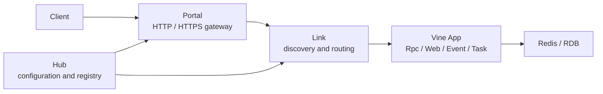

# Vine

[](LICENSE)
[](https://github.com/yorun-ai/vine/releases/latest)
[](go.mod)
[](https://pkg.go.dev/go.yorun.ai/vine)
[](https://github.com/yorun-ai/vine/actions/workflows/ci.yml)

**English** | [简体中文](README.zh-CN.md)

Vine is a runtime framework for Go applications. It brings application lifecycle, dependency injection, configuration, Rpc, Web, Event, Task, and infrastructure components into a unified application model. Hub, Link, and Portal let the same application move smoothly from single-process development to multi-process deployment.

> Vine is currently stabilizing its public API before 1.0. Minor releases may contain breaking changes, while patch releases remain backward-compatible within the same minor release line. The first public release starts at `v0.9.0`; historical internal versions are outside the public compatibility commitment.

## Features

- Unified application, component, and module lifecycles
- Go type-based dependency injection and execution scopes
- Type-safe Rpc, Web, Event, and Task contracts
- Integrated configuration, logging, Redis, and relational databases
- Standalone, linked, and separated deployment modes
- Service registration, discovery, and external gateways through Hub, Link, and Portal
- Go and TypeScript contract generation powered by skelc
- English and Chinese documentation

## Architecture


```mermaid
flowchart LR
    Client["Client"] --> Portal["Portal<br/>HTTP / HTTPS gateway"]
    Portal --> Link["Link<br/>discovery and routing"]
    Link --> App["Vine App<br/>Rpc / Web / Event / Task"]
    App --> Infra["Redis / RDB"]
    Hub["Hub<br/>configuration and registry"] --> Portal
    Hub --> Link
```

- **App** hosts business components, modules, and exposed capabilities.
- **Hub** manages configuration, service registration, and runtime state.
- **Link** connects applications to Hub and provides service discovery and request forwarding.
- **Portal** provides external HTTP, HTTPS, Rpc, and Web entry points.

For local development, standalone mode starts the complete runtime in one process. Deployments can separate Hub, Link, Portal, and business applications as needed.

## Get Started in 5 Minutes

Prerequisite: Go 1.26.5 or later.

```bash
mkdir vine-hello
cd vine-hello
go mod init example.com/vine-hello
go get go.yorun.ai/vine@v0.11.0
```

Create `main.go`:

```go
package main

import (
	"go.yorun.ai/vine/app"
	"go.yorun.ai/vine/app/standalone"
	"go.yorun.ai/vine/core/logger"
)

type HelloModule struct {
	app.BaseModule
}

func (*HelloModule) AfterAppStart() {
	logger.Info("hello from Vine")
}

type HelloApp struct {
	app.Application
}

func (*HelloApp) Name() string {
	return "demo.hello"
}

func (*HelloApp) InitModules(add app.TypeAdder) {
	add(app.T[*HelloModule]())
}

func main() {
	standalone.NewWithOption[*HelloApp](standalone.Option{
		SQLiteFile: "./vine.sqlite",
	}).StartAndWait()
}
```

Run the application:

```bash
go run .
```

When `hello from Vine` appears in the log, the complete standalone runtime and business application are running. Press `Ctrl+C` for graceful shutdown.

## Documentation

- [Getting started](https://vine.yorun.ai/docs/getting-started)
- [Build your first application](https://vine.yorun.ai/docs/tutorial-first-app)
- [Deployment modes](https://vine.yorun.ai/docs/deployment-modes)
- [Framework package index](https://vine.yorun.ai/docs/core-packages)
- [Go API reference](https://pkg.go.dev/go.yorun.ai/vine)
- [Changelog](./CHANGELOG.md)
- [Documentation (Chinese)](https://vine.yorun.ai/zh-CN/docs/)

The documentation site source is maintained in
[`yorun-ai/vine-site`](https://github.com/yorun-ai/vine-site). Preview the site
from a `vine-site` checkout with:

```bash
cd vine-site
pnpm install
pnpm dev
```

## Backend mTLS

`vine hub serve`, `vine link serve`, and `vine portal serve` accept
`--mtls-ca-file`, `--mtls-cert-file`, and `--mtls-key-file` (or the matching
`VINE_MTLS_*` environment variables). Configure all three together. Each
certificate must be an X.509-SVID with exactly one SPIFFE URI SAN. Hub, Link,
and Portal use `spiffe://<trust-domain>/vine/daemon/vine.hub`,
`spiffe://<trust-domain>/vine/daemon/vine.link`, and
`spiffe://<trust-domain>/vine/daemon/vine.portal` respectively. All communicating
components must share the same trust domain, and every certificate must be
valid for both TLS server and client authentication. DNS SANs, when present,
are not used for component authorization.

When configured, Vine requires mTLS on the Hub Control and Admin APIs, embedded
Hub Redis and NATS, and Link ingress. Link and Portal use the same component
certificate as their client credential, discovered HTTP endpoints cannot
downgrade to plaintext, and Hub Redis binds its Redis ACL username to the mTLS
client identity. Portal's public listeners remain under the existing Portal
certificate-vault configuration. When mTLS is enabled, Portal can temporarily
serve an HTTPS entry without a configured public certificate by generating a
short-lived, process-local self-signed Web certificate for the requested SNI
host. A configured Portal certificate always takes precedence; the temporary
certificate only encrypts bootstrap traffic and is not browser-trusted.
Application-to-Link traffic remains h2c because Link is the application's
sidecar: both must run on the same host and within the same deployment trust
boundary. Placing an application and its Link on different hosts is not a
supported Vine topology.

Certificate issuance, rotation, and revocation remain deployment concerns.
External PostgreSQL and NATS connections use those services' own security
configuration.

The embedded Hub Redis server rejects anonymous data access and uses separate
`vine.hub`, `vine.link`, and `vine.portal` users. The process-local `vine.hub`
user has a random password and full access; the `vine.link` and `vine.portal`
users have distinct least-privilege key and subscription ACLs.

The Link and Portal Redis passwords remain empty for inproc mode and separated
deployment debugging. With backend mTLS enabled, the certificate identity
authenticates and binds those users to their roles. Without mTLS, the usernames
only select an ACL role, so internal endpoints must remain on loopback or a
trusted private network and be restricted with a firewall.

## Versioning and Compatibility

Vine follows [Semantic Versioning](https://semver.org/). Before `v1.0.0`:

- Patch releases, such as `v0.9.1`, remain backward-compatible within the same minor release line.
- Minor releases, such as `v0.10.0`, may change public APIs, CLI behavior, configuration, Skel, or protocols.
- Breaking changes are documented in release notes and migration guides.

`v1.0.0` will mark the stable public API and begin Vine's formal compatibility commitment.

## License

Vine is open source under the [Apache License 2.0](./LICENSE).
Binary distributions must include both `LICENSE` and
[`THIRD_PARTY_LICENSES.txt`](./THIRD_PARTY_LICENSES.txt). Regenerate the
third-party file after dependency changes with:

```bash
bash script/gen-third-party-licenses.sh
```
