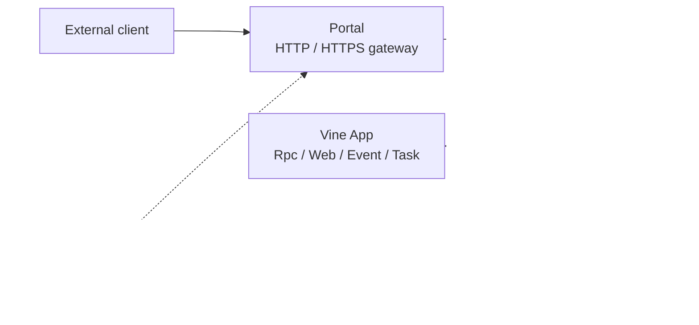

# Vine

[](LICENSE)
[](https://github.com/yorun-ai/vine/releases/latest)
[](go.mod)
[](https://pkg.go.dev/go.yorun.ai/vine)
[](https://github.com/yorun-ai/vine/actions/workflows/ci.yml)

**English** | [简体中文](README.zh-CN.md)

Vine is a runtime framework for contract-first Go applications. It unifies
application lifecycle, dependency injection, configuration, Rpc, Web, Event,
Task, Redis, and relational databases, then carries the same application model
from a one-process development runtime to a separated deployment with Hub,
Link, and Portal.

Use Vine when the application needs more than an HTTP router: typed
cross-application contracts, runtime discovery, asynchronous delivery,
configuration updates, external gateways, and predictable startup and graceful
shutdown boundaries.

> Vine is stabilizing its public API before `v1.0.0`. Patch releases remain
> backward-compatible within one minor release line; minor releases may contain
> documented breaking changes. The public compatibility history starts at
> `v0.9.0`.

## At a Glance

| Area | What Vine provides |
| --- | --- |
| Application model | Ordered component and module lifecycle, type-based dependency injection, execution scopes, and graceful shutdown |
| Typed capabilities | Rpc request/response, Web routes, Event fan-out, Task competing consumers, and managed configuration |
| Runtime services | Hub configuration and registry, Link discovery and forwarding, and optional Portal HTTP/HTTPS gateways |
| Infrastructure | Structured logging, trace and identity propagation, Redis clients/caches/locks, and SQLite or PostgreSQL-backed RDB access |
| Tooling | `vine` runtime CLI, `app/testkit`, Go API facades, and Skel-generated Go and TypeScript contracts |
| Deployment | Standalone, local `vine dev`, linked, and fully separated topologies without rewriting business modules |

## Runtime Architecture


```mermaid
flowchart LR
    Client["External client"] --> Portal["Portal<br/>HTTP / HTTPS gateway"]
    Portal --> Link["Link<br/>discovery and forwarding"]
    App["Vine App<br/>Rpc / Web / Event / Task"] <--> Link
    Hub["Hub<br/>configuration and registry"] -.-> Link
    Hub -.-> Portal
    Hub --> Infra["SQLite / PostgreSQL<br/>Redis / NATS"]
```

| Role | Responsibility |
| --- | --- |
| **App** | Owns business modules, handlers, configuration schemas, and infrastructure dependencies. |
| **Link** | Registers local applications, watches discovery/configuration state, selects instances, forwards Rpc/Web traffic, and delivers Event/Task messages. |
| **Hub** | Owns configuration, schemas, registrations, leases, Portal configuration, management APIs, and the Dashboard. |
| **Portal** | Provides optional external HTTP/HTTPS entry points, routing, admission, and public TLS certificate selection. |

Internal application-to-application calls use Link and do not pass through
Portal. Standalone mode keeps the same responsibilities but replaces the
network boundaries with in-process transports.

## Quick Start

Prerequisite: Go 1.27.0 or later.

```bash
mkdir vine-hello
cd vine-hello
go mod init example.com/vine-hello
go get go.yorun.ai/vine@latest
```

Go records the resolved release in `go.mod`. Review and commit `go.mod` and
`go.sum`; use an explicit Vine tag in bootstrap scripts that must be
reproducible.

Create `main.go`:

```go
package main

import (
	"go.yorun.ai/vine/app"
	"go.yorun.ai/vine/app/standalone"
	"go.yorun.ai/vine/core/logger"
)

type HelloModule struct {
	app.BaseModule
}

func (*HelloModule) AfterAppStart() {
	logger.Info("hello from Vine")
}

type HelloApp struct {
	app.Application
}

func (*HelloApp) Name() string {
	return "demo.hello"
}

func (*HelloApp) InitModules(add app.TypeAdder) {
	add(app.T[*HelloModule]())
}

func main() {
	standalone.NewWithOption[*HelloApp](standalone.Option{
		SQLiteFile: "./vine.sqlite",
	}).StartAndWait()
}
```

Run it:

```bash
go run .
```

When `hello from Vine` appears, Hub, Portal, Link, and the business application
are running in one process. Press `Ctrl+C` to stop them in reverse lifecycle
order. Continue with the
[first application tutorial](https://vine.yorun.ai/docs/getting-started/tutorial-first-app)
or define a typed API in the
[first Skel contract](https://vine.yorun.ai/docs/getting-started/first-contract).

## Choose a Runtime Mode

| Mode | Runtime placement | Start with | Best for |
| --- | --- | --- | --- |
| **Standalone** | Hub, Portal, Link, and App share one process | `app/standalone` | First applications, package tests, and local monoliths |
| **`vine dev`** | Hub, Portal, and Link share the CLI process; App runs separately | `vine dev` + `app.New` | Debugging a real App-to-Link network boundary with temporary local infrastructure |
| **Linked** | Hub and Portal are separate; Link runs inside the App process | `app/linked` | Shared runtime services without a separate Link sidecar |
| **Separated** | Hub, Portal, Link, and App run as independent processes | `vine ... serve` + `app.New` | Container deployment, independent scaling, leases, and failure testing |

The same `ApplicationSpec`, modules, and Rpc/Web/Event/Task implementations work
in every mode. Only the startup assembly and endpoint configuration change. See
[Deployment modes](https://vine.yorun.ai/docs/deployment-modes) for diagrams,
commands, lifecycle differences, and production tradeoffs.

## Vine CLI

Install the released CLI and inspect its commands:

```bash
go install go.yorun.ai/vine/cmd/vine@latest
vine version
vine --help
```

Use an exact release tag instead of `@latest` in deployment build scripts.

Common entry points:

```bash
# Local Hub + Portal + Link; uses temporary SQLite when no DB is supplied.
vine dev

# Independently operated runtime services; run each in its own process.
vine hub serve --mq-embedded-nats --db-sqlite-file ./hub.sqlite
vine portal serve --hub-endpoint http://127.0.0.1:7071
vine link serve \
  --api-listen 127.0.0.1:7079 \
  --ingress-listen 127.0.0.1:7082 \
  --hub-endpoint http://127.0.0.1:7071
```

Read the [CLI guide](https://vine.yorun.ai/docs/getting-started/cli) before
operating the separated services; it documents persistence, NATS, listener,
seed, Dashboard, environment-variable, and backend mTLS options.

## Docker Images

The Container images workflow publishes the three separated runtime services
to GitHub Container Registry. Pull the published images directly when the
packages are public:

```bash
docker pull ghcr.io/yorun-ai/vine/vine-hub:latest
docker pull ghcr.io/yorun-ai/vine/vine-link:latest
docker pull ghcr.io/yorun-ai/vine/vine-portal:latest
```

The root `Dockerfile` is also a multi-target build for local development or
air-gapped registries. Build each image with the corresponding target:

```bash
docker build --target hub -t vine-hub:local .
docker build --target portal -t vine-portal:local .
docker build --target link -t vine-link:local .
```

The startup example below uses the GHCR images. Replace the image names with
the `:local` names above when running locally built images.

The images run as the non-root `vine` user. Hub stores its default SQLite file
at `/data/hub.sqlite` and starts embedded NATS; mount `/data` for persistence.
Portal and Link use `http://hub:7071` as their default Hub endpoint, so put the
containers on the same Docker network and give the Hub container the name
`hub`, or override `VINE_HUB_ENDPOINT`. Portal exposes the Hub-seeded Dashboard
entry on port `7099`; application Portal rules may add listeners on ports `80`,
`443`, or other configured ports.
Override the `VINE_*` environment variables for PostgreSQL, external NATS,
listeners, or backend mTLS in separated deployments.

### Start the three containers

The following example runs all three services on one Docker network and keeps
Hub's SQLite database in a named volume:

```bash
docker network create vine-net
docker volume create vine-hub-data

docker run -d \
  --name hub \
  --network vine-net \
  -v vine-hub-data:/data \
  -p 7071:7071 \
  -p 7075:7075 \
  ghcr.io/yorun-ai/vine/vine-hub:latest
```

Wait until Hub logs `vine.hub http server started`, then start Link and Portal:

```bash
docker run -d \
  --name link \
  --network vine-net \
  -p 7079:7079 \
  -p 7082:7082 \
  ghcr.io/yorun-ai/vine/vine-link:latest

docker run -d \
  --name portal \
  --network vine-net \
  -p 7099:7099 \
  -p 80:80 \
  -p 443:443 \
  ghcr.io/yorun-ai/vine/vine-portal:latest
```

The `hub` container name is resolved by Link and Portal as `http://hub:7071`.
Port `7075` serves the Hub Dashboard, port `7099` serves the default Portal
Dashboard entry, and ports `80`/`443` are available when application Portal
rules configure listeners there. Remove any host port mapping that is not
needed or is already in use. Check the services with `docker ps` and inspect
startup failures with `docker logs hub`, `docker logs link`, or `docker logs portal`.

To stop the example without deleting the database volume:

```bash
docker rm -f portal link hub
docker network rm vine-net
```

For the independently deployable Kubernetes examples, see the [Kubernetes deployment guide](examples/k8s/README.md).

The [Container images workflow](.github/workflows/container.yml) builds all
three targets for pull requests. Pushes to `main` publish `latest`, `main`, and
commit-SHA tags; version tags matching `v*.*.*` publish the matching release
tag. Images are published to GitHub Container Registry as
`ghcr.io/yorun-ai/vine/vine-hub`, `ghcr.io/yorun-ai/vine/vine-link`, and
`ghcr.io/yorun-ai/vine/vine-portal`.

The first publish creates the GHCR packages. To allow unauthenticated
`docker pull` and Kubernetes pulls, set each package (`vine-hub`, `vine-link`,
and `vine-portal`) to **Public** in GitHub Package settings. If the packages
remain private, authenticate Docker with `docker login ghcr.io` and configure
an `imagePullSecret` in Kubernetes.

## Public Package Map

Vine keeps its public API in a small set of facade packages. Packages under
`internal` are implementation details and are not application APIs.

| Packages | Purpose |
| --- | --- |
| [`app`](app), [`app/standalone`](app/standalone), [`app/linked`](app/linked) | Application construction, lifecycle, bundling, and runtime topology |
| [`app/testkit`](app/testkit) | Standalone runtime setup, configuration overrides, and execution helpers for tests |
| [`core/di`](core/di), [`core/ctr`](core/ctr) | Dependency injection and container access |
| [`core/rpc`](core/rpc), [`core/web`](core/web) | Synchronous service contracts and Web handling |
| [`core/event`](core/event), [`core/task`](core/task) | Asynchronous fan-out and competing-consumer work |
| [`core/conf`](core/conf) | Eternal configuration snapshots and instant configuration updates |
| [`core/meta`](core/meta), [`core/logger`](core/logger), [`core/ex`](core/ex), [`core/redact`](core/redact) | Request metadata, structured logging, system errors, and sensitive-data redaction |
| [`infra/redis`](infra/redis), [`infra/rdb`](infra/rdb) | Managed Redis and relational database integration |
| [`util`](util) | Reusable encoding, file, collection, math, network, validation, and string helpers |

Use the [framework package index](https://vine.yorun.ai/docs/framework/core-packages)
for a guided map and [pkg.go.dev](https://pkg.go.dev/go.yorun.ai/vine) for exact
API signatures.

## Contracts and Ecosystem

Vine uses [Skel](https://skel.yorun.ai/docs/) contracts for Rpc, Web, Event,
Task, configuration, actor, and resource definitions. `skelc` validates those
contracts and generates the Go/TypeScript boundary code; business behavior stays
in your Vine modules and handlers.

| Project | Role |
| --- | --- |
| [`yorun-ai/skelc`](https://github.com/yorun-ai/skelc) | Skel parser, validator, formatter, LSP, and code generator |
| [Skel documentation](https://skel.yorun.ai/docs/) | Language, CLI, generation, and compatibility reference |
| [`@yorun-ai/vrpc`](https://www.npmjs.com/package/@yorun-ai/vrpc) | TypeScript vRPC and HTTP client runtime |
| [`yorun-ai/skel-editor-support`](https://github.com/yorun-ai/skel-editor-support) | Syntax highlighting and VS Code integration |
| [`yorun-ai/vine-site`](https://github.com/yorun-ai/vine-site) | Source for the public Vine documentation site |

## Documentation

- [Start with Vine](https://vine.yorun.ai/docs/getting-started)
- [Build your first application](https://vine.yorun.ai/docs/getting-started/tutorial-first-app)
- [Write your first Skel contract](https://vine.yorun.ai/docs/getting-started/first-contract)
- [Application lifecycle](https://vine.yorun.ai/docs/runtime/application-lifecycle)
- [Request routing and readiness](https://vine.yorun.ai/docs/runtime/request-routing)
- [Deployment modes](https://vine.yorun.ai/docs/deployment-modes)
- [Production readiness](https://vine.yorun.ai/docs/production-readiness)
- [Go API reference](https://pkg.go.dev/go.yorun.ai/vine)
- [Changelog](CHANGELOG.md)
- [Simplified Chinese documentation](https://vine.yorun.ai/zh-CN/docs/getting-started)

The documentation site tracks current source and may be ahead of the latest
release. For deployed systems, pin Vine and skelc, then read the compatibility
page and release notes for those exact versions.

## Security and Production Boundaries

Vine can require deployment-provided backend mTLS identities for Hub, Link, and
Portal. The three components use exact X.509-SVID URI SANs under one trust
domain:

```text
spiffe://<trust-domain>/vine/daemon/vine.hub
spiffe://<trust-domain>/vine/daemon/vine.link
spiffe://<trust-domain>/vine/daemon/vine.portal
```

Configure `--mtls-ca-file`, `--mtls-cert-file`, and `--mtls-key-file` together.
Backend mTLS protects Hub Control/Admin APIs, embedded Hub Redis and NATS, Link
ingress, and component proxy clients. Portal's public HTTPS certificates are a
separate configuration boundary. Application-to-Link traffic remains h2c under
the sidecar/co-location trust model, so keep it on loopback or protect any
unusual cross-host path at the deployment layer.

The embedded Redis ACL separates Hub, Link, and Portal roles. External
PostgreSQL and NATS services retain their own authentication, encryption,
durability, and operational requirements. Before production, review the
[production readiness checklist](https://vine.yorun.ai/docs/production-readiness)
for listener exposure, mTLS, persistence, delivery, leases, shutdown, scaling,
and observability constraints.

## Repository Layout and Development

```text
vine/
├── app/       # application construction, runtime modes, and testkit
├── core/      # public framework APIs
├── infra/     # public Redis and RDB integrations
├── util/      # public reusable helpers
├── cmd/vine/  # runtime CLI
├── internal/  # framework and Hub/Link/Portal implementations
├── script/    # generation and release-support scripts
└── test/      # repository-wide test and race entry points
```

Start with [CONTRIBUTING.md](CONTRIBUTING.md) and [AGENTS.md](AGENTS.md). The
baseline repository checks are:

```bash
go mod download
bash test/test.sh
bash test/race.sh
GOWORK=off go vet ./...
```

Generated Skel code, the Hub Dashboard, and public documentation have additional
workflows documented in the contribution guide. Public documentation changes
belong in `yorun-ai/vine-site`; keep English and Simplified Chinese content in
sync.

## Versioning and Compatibility

Vine follows [Semantic Versioning](https://semver.org/). Before `v1.0.0`:

- Patch releases, such as `v0.11.1`, remain backward-compatible within the same
  minor release line.
- Minor releases may change public APIs, CLI behavior, configuration, Skel, or
  protocols.
- Breaking changes are documented in release notes and migration guidance.

`v1.0.0` will mark the stable public API and begin Vine's formal compatibility
commitment.

## License

Vine is open source under the [Apache License 2.0](LICENSE). Binary
distributions must include both `LICENSE` and
[`THIRD_PARTY_LICENSES.txt`](THIRD_PARTY_LICENSES.txt). Regenerate the
third-party file after dependency changes with:

```bash
bash script/gen-third-party-licenses.sh
```
