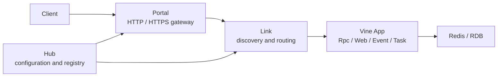

# Vine

[](LICENSE)
[](https://github.com/yorun-ai/vine/releases/latest)
[](go.mod)
[](https://github.com/yorun-ai/vine/actions/workflows/ci.yml)

[English](README.md) | **简体中文**

Vine 是一个面向 Go 应用的运行框架。它将应用生命周期、依赖注入、配置、Rpc、Web、Event、Task 和基础设施组件统一到一套应用模型中，并通过 Hub、Link、Portal 支持从单进程开发平滑过渡到多进程部署。

> Vine 当前处于 1.0 前的公开 API 稳定阶段。次版本可能包含不兼容调整；同一次版本内的补丁版本保持向后兼容。首次公开版本从 `v0.9.0` 开始，历史内部版本不属于公开兼容性承诺。

## 特性

- 统一的应用、组件、模块生命周期
- 基于 Go 类型的依赖注入和执行作用域
- 类型安全的 Rpc、Web、Event 与 Task 契约
- 配置、日志、Redis 和关系型数据库集成
- standalone、linked 与分离式部署模式
- Hub、Link、Portal 组成的服务注册、发现和外部网关
- skelc 驱动的 Go、TypeScript 契约代码生成
- 中文和英文文档

## 架构



- **App** 承载业务组件、模块和对外能力。
- **Hub** 管理配置、服务注册及运行时信息。
- **Link** 将应用连接到 Hub，完成服务发现和请求转发。
- **Portal** 为外部客户端提供 HTTP、HTTPS、Rpc 和 Web 入口。

本地开发可使用 standalone 模式，在一个进程中启动完整运行时；部署时可按需拆分 Hub、Link、Portal 和业务应用。

## 5 分钟开始

前提条件：Go 1.26 或更高版本。

```bash
mkdir vine-hello
cd vine-hello
go mod init example.com/vine-hello
go get go.yorun.ai/vine@v0.9.0
```

创建 `main.go`：

```go
package main

import (
	"go.yorun.ai/vine/app"
	"go.yorun.ai/vine/app/standalone"
	"go.yorun.ai/vine/core/logger"
)

type HelloModule struct {
	app.BaseModule
}

func (*HelloModule) AfterAppStart() {
	logger.Info("hello from Vine")
}

type HelloApp struct {
	app.Application
}

func (*HelloApp) Name() string {
	return "demo.hello"
}

func (*HelloApp) InitModules(add app.TypeAdder) {
	add(app.T[*HelloModule]())
}

func main() {
	standalone.NewWithOption[*HelloApp](standalone.Option{
		SQLiteFile: "./vine.sqlite",
	}).StartAndWait()
}
```

运行应用：

```bash
go run .
```

日志出现 `hello from Vine` 后即表示完整的 standalone 运行时和业务应用已经启动。按 `Ctrl+C` 可优雅停止。

## 文档

- [开始使用](https://yorun.ai/vine/getting-started)
- [首个应用教程](https://yorun.ai/vine/tutorial-first-app)
- [运行模式](https://yorun.ai/vine/deployment-modes)
- [框架包索引](https://yorun.ai/vine/core-packages)
- [English documentation](https://yorun.ai/en/vine/)

文档站源码在 [`yorun-ai/vine-doc`](https://github.com/yorun-ai/vine-doc)
中维护。在 `vine-doc` checkout 中本地预览：

```bash
cd vine-doc
pnpm install
pnpm start
```

## 安全状态

> **TODO：**为 Hub、Link、Portal 与应用进程之间的通信增加身份认证和传输加密。

Hub 内嵌 Redis 当前允许客户端免密码只读连接，其中分发的运行时配置包含 Portal
TLS 私钥。在组件认证和传输加密完成前，Vine 内部 endpoint 只能绑定到回环地址或
受信私有网络，并应使用防火墙限制访问，禁止暴露到不可信网络。

## 版本与兼容性

Vine 遵循[语义化版本](https://semver.org/lang/zh-CN/)。在 `v1.0.0` 之前：

- 补丁版本（例如 `v0.9.1`）在同一次版本内保持向后兼容。
- 次版本（例如 `v0.10.0`）可能调整公开 API、CLI、配置、Skel 或协议。
- 不兼容变更会在发布说明和迁移指南中明确记录。

`v1.0.0` 将作为公开 API 稳定并开始提供正式兼容性承诺的版本。

## 许可证

Vine 使用 [Apache License 2.0](./LICENSE) 开源。
二进制发布包必须同时包含 `LICENSE` 和
[`THIRD_PARTY_LICENSES.txt`](./THIRD_PARTY_LICENSES.txt)。依赖发生变化后，使用以下命令重新生成第三方许可证文件：

```bash
bash script/gen-third-party-licenses.sh
```
