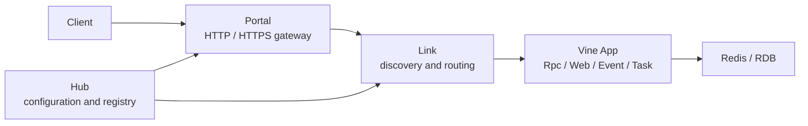

# Vine

[](LICENSE)
[](https://github.com/yorun-ai/vine/releases/latest)
[](go.mod)
[](https://pkg.go.dev/go.yorun.ai/vine)
[](https://github.com/yorun-ai/vine/actions/workflows/ci.yml)

[English](README.md) | **简体中文**

Vine 是一个面向 Go 应用的运行框架。它将应用生命周期、依赖注入、配置、Rpc、Web、Event、Task 和基础设施组件统一到一套应用模型中，并通过 Hub、Link、Portal 支持从单进程开发平滑过渡到多进程部署。

> Vine 当前处于 1.0 前的公开 API 稳定阶段。次版本可能包含不兼容调整；同一次版本内的补丁版本保持向后兼容。首次公开版本从 `v0.9.0` 开始，历史内部版本不属于公开兼容性承诺。

## 特性

- 统一的应用、组件、模块生命周期
- 基于 Go 类型的依赖注入和执行作用域
- 类型安全的 Rpc、Web、Event 与 Task 契约
- 配置、日志、Redis 和关系型数据库集成
- standalone、linked 与分离式部署模式
- Hub、Link、Portal 组成的服务注册、发现和外部网关
- skelc 驱动的 Go、TypeScript 契约代码生成
- 中文和英文文档

## 架构


```mermaid
flowchart LR
    Client["Client"] --> Portal["Portal<br/>HTTP / HTTPS gateway"]
    Portal --> Link["Link<br/>discovery and routing"]
    Link --> App["Vine App<br/>Rpc / Web / Event / Task"]
    App --> Infra["Redis / RDB"]
    Hub["Hub<br/>configuration and registry"] --> Portal
    Hub --> Link
```

- **App** 承载业务组件、模块和对外能力。
- **Hub** 管理配置、服务注册及运行时信息。
- **Link** 将应用连接到 Hub，完成服务发现和请求转发。
- **Portal** 为外部客户端提供 HTTP、HTTPS、Rpc 和 Web 入口。

本地开发可使用 standalone 模式，在一个进程中启动完整运行时；部署时可按需拆分 Hub、Link、Portal 和业务应用。

## 5 分钟开始

前提条件：Go 1.26.5 或更高版本。

```bash
mkdir vine-hello
cd vine-hello
go mod init example.com/vine-hello
go get go.yorun.ai/vine@v0.11.0
```

创建 `main.go`：

```go
package main

import (
	"go.yorun.ai/vine/app"
	"go.yorun.ai/vine/app/standalone"
	"go.yorun.ai/vine/core/logger"
)

type HelloModule struct {
	app.BaseModule
}

func (*HelloModule) AfterAppStart() {
	logger.Info("hello from Vine")
}

type HelloApp struct {
	app.Application
}

func (*HelloApp) Name() string {
	return "demo.hello"
}

func (*HelloApp) InitModules(add app.TypeAdder) {
	add(app.T[*HelloModule]())
}

func main() {
	standalone.NewWithOption[*HelloApp](standalone.Option{
		SQLiteFile: "./vine.sqlite",
	}).StartAndWait()
}
```

运行应用：

```bash
go run .
```

日志出现 `hello from Vine` 后即表示完整的 standalone 运行时和业务应用已经启动。按 `Ctrl+C` 可优雅停止。

## 文档

- [开始使用](https://vine.yorun.ai/zh-CN/docs/getting-started)
- [首个应用教程](https://vine.yorun.ai/zh-CN/docs/tutorial-first-app)
- [运行模式](https://vine.yorun.ai/zh-CN/docs/deployment-modes)
- [框架包索引](https://vine.yorun.ai/zh-CN/docs/core-packages)
- [Go API 参考](https://pkg.go.dev/go.yorun.ai/vine)
- [更新日志](./CHANGELOG.md)
- [English documentation](https://vine.yorun.ai/docs/)

文档站源码在 [`yorun-ai/vine-site`](https://github.com/yorun-ai/vine-site)
中维护。在 `vine-site` checkout 中本地预览：

```bash
cd vine-site
pnpm install
pnpm dev:zh
```

## 后端 mTLS

`vine hub serve`、`vine link serve` 和 `vine portal serve` 支持
`--mtls-ca-file`、`--mtls-cert-file` 与 `--mtls-key-file` 参数（也可以使用对应的
`VINE_MTLS_*` 环境变量），三项必须同时配置。每个证书必须是仅包含一个 SPIFFE URI
SAN 的 X.509-SVID。Hub、Link 与 Portal 分别使用
`spiffe://<trust-domain>/vine/daemon/vine.hub`、
`spiffe://<trust-domain>/vine/daemon/vine.link` 和
`spiffe://<trust-domain>/vine/daemon/vine.portal`。互相通信的组件必须属于同一个
trust domain，证书也必须同时允许 TLS 服务端与客户端认证。证书中的 DNS SAN
不会参与组件身份授权。

使用 `app/linked` 的应用可以通过相同的参数和环境变量配置进程内 Link，也可以设置
`linked.Option.MTLSCAFile`、`MTLSCertFile` 与 `MTLSKeyFile`。这些文件标识的是
内嵌的 `vine.link` workload，而不是业务应用。

配置后，Vine 会在 Hub Control API、Admin API、内嵌 Redis、内嵌 NATS 和 Link
ingress 上强制使用 mTLS。Link 与 Portal 使用同一份组件证书作为客户端凭证；服务
发现得到的 HTTP endpoint 不允许降级为明文；Hub Redis 也会把 Redis ACL 用户名与
mTLS 客户端身份绑定。Portal 的公网 listener 仍由既有的 Portal certificate vault
管理。启用 mTLS 后，如果 HTTPS entry 没有配置公网证书，Portal 可以按请求的 SNI
host 生成进程内短期自签名 Web 证书。显式配置的 Portal 证书始终优先；临时证书仅
为启动阶段提供加密，不受浏览器信任。Link 是 App 的 sidecar，预期情况下两者位于
同一主机和部署信任边界内，因此 App 到 Link 的通信仍使用 h2c。Vine 仍允许显式配置
非 loopback 的 Link API 来适配特殊部署，但会输出警告，也不会额外增加传输认证；
跨主机流量需要由部署方自行保护。

证书签发、轮换与吊销仍由部署系统负责。外部 PostgreSQL 与 NATS 连接使用各自服务
的安全配置。

Hub 内嵌 Redis 拒绝匿名数据访问，并分别定义 `vine.hub`、`vine.link` 与
`vine.portal` 用户。进程内使用的 `vine.hub` 用户拥有随机密码与完整权限；
`vine.link` 和 `vine.portal` 用户分别具有最小化的 key 与订阅 ACL。

Link 与 Portal 的 Redis 密码目前仍为空，用于 inproc 模式和分离部署调试。启用后端
mTLS 时，证书身份会认证客户端并将其绑定到对应角色。未启用 mTLS 时，用户名只能
选择 ACL 角色，不能认证调用方，因此内部 endpoint 必须位于回环地址或受信私有网络，
并通过防火墙限制访问。

## 版本与兼容性

Vine 遵循[语义化版本](https://semver.org/lang/zh-CN/)。在 `v1.0.0` 之前：

- 补丁版本（例如 `v0.9.1`）在同一次版本内保持向后兼容。
- 次版本（例如 `v0.10.0`）可能调整公开 API、CLI、配置、Skel 或协议。
- 不兼容变更会在发布说明和迁移指南中明确记录。

`v1.0.0` 将作为公开 API 稳定并开始提供正式兼容性承诺的版本。

## 许可证

Vine 使用 [Apache License 2.0](./LICENSE) 开源。
二进制发布包必须同时包含 `LICENSE` 和
[`THIRD_PARTY_LICENSES.txt`](./THIRD_PARTY_LICENSES.txt)。依赖发生变化后，使用以下命令重新生成第三方许可证文件：

```bash
bash script/gen-third-party-licenses.sh
```
