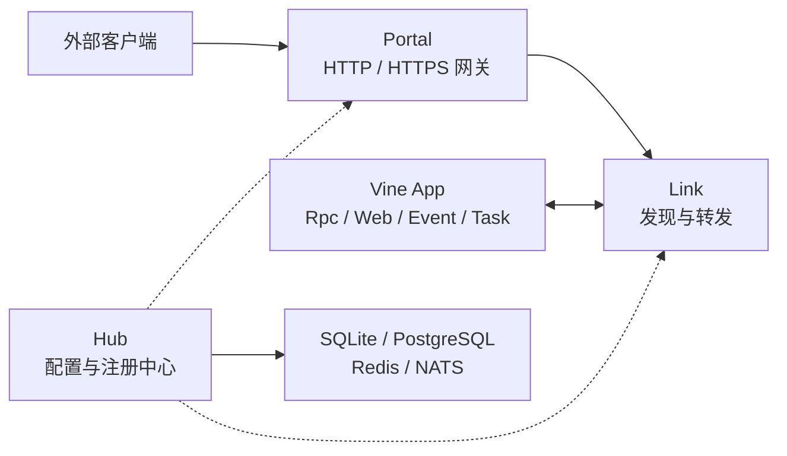

# Vine

[](LICENSE)
[](https://github.com/yorun-ai/vine/releases/latest)
[](go.mod)
[](https://pkg.go.dev/go.yorun.ai/vine)
[](https://github.com/yorun-ai/vine/actions/workflows/ci.yml)

[English](README.md) | **简体中文**

Vine 是一个面向契约优先 Go 应用的运行框架。它统一应用生命周期、依赖注入、配置、
Rpc、Web、Event、Task、Redis 与关系型数据库，并让同一套应用模型从单进程开发运行时
平滑演进到由 Hub、Link、Portal 组成的分离式部署。

当应用需要的不只是 HTTP 路由器，而是类型安全的跨应用契约、运行时发现、异步投递、
配置更新、外部网关，以及明确的启动与优雅关闭边界时，可以使用 Vine。

> Vine 当前处于 `v1.0.0` 前的公开 API 稳定阶段。同一次版本内的补丁版本保持向后兼容；
> 次版本可能包含有文档说明的不兼容调整。公开兼容性历史从 `v0.9.0` 开始。

## 一览

| 领域 | Vine 提供的能力 |
| --- | --- |
| 应用模型 | 有序的组件与模块生命周期、基于类型的依赖注入、执行作用域和优雅关闭 |
| 类型化能力 | Rpc 请求/响应、Web 路由、Event 广播、Task 竞争消费和托管配置 |
| 运行时服务 | Hub 配置与注册中心、Link 发现与转发，以及可选的 Portal HTTP/HTTPS 网关 |
| 基础设施 | 结构化日志、trace 与身份传播、Redis client/cache/lock，以及基于 SQLite 或 PostgreSQL 的 RDB |
| 工具链 | `vine` 运行时 CLI、`app/testkit`、Go 公开 API facade，以及 Skel 生成的 Go/TypeScript 契约 |
| 部署 | standalone、本地 `vine dev`、linked 与完全分离式拓扑，无需重写业务模块 |

## 运行时架构


```mermaid
flowchart LR
    Client["外部客户端"] --> Portal["Portal<br/>HTTP / HTTPS 网关"]
    Portal --> Link["Link<br/>发现与转发"]
    App["Vine App<br/>Rpc / Web / Event / Task"] <--> Link
    Hub["Hub<br/>配置与注册中心"] -.-> Link
    Hub -.-> Portal
    Hub --> Infra["SQLite / PostgreSQL<br/>Redis / NATS"]
```

| 角色 | 职责 |
| --- | --- |
| **App** | 承载业务模块、handler、配置 schema 和应用拥有的基础设施依赖。 |
| **Link** | 注册本地应用，订阅发现与配置状态，选择实例，转发 Rpc/Web 流量并投递 Event/Task。 |
| **Hub** | 管理配置、schema、注册、租约、Portal 配置、管理 API 和 Dashboard。 |
| **Portal** | 提供可选的外部 HTTP/HTTPS 入口、路由、准入和公网 TLS 证书选择。 |

应用之间的内部调用经过 Link，不经过 Portal。standalone 模式保留相同的职责边界，只是
把网络通信替换为进程内 transport。

## 快速开始

前提条件：Go 1.27.0 或更高版本。

```bash
mkdir vine-hello
cd vine-hello
go mod init example.com/vine-hello
go get go.yorun.ai/vine@latest
```

Go 会把解析后的明确版本写入 `go.mod`。请审核并提交 `go.mod` 与 `go.sum`；需要可复现的
初始化脚本应显式指定 Vine 发布 tag。

创建 `main.go`：

```go
package main

import (
	"go.yorun.ai/vine/app"
	"go.yorun.ai/vine/app/standalone"
	"go.yorun.ai/vine/core/logger"
)

type HelloModule struct {
	app.BaseModule
}

func (*HelloModule) AfterAppStart() {
	logger.Info("hello from Vine")
}

type HelloApp struct {
	app.Application
}

func (*HelloApp) Name() string {
	return "demo.hello"
}

func (*HelloApp) InitModules(add app.TypeAdder) {
	add(app.T[*HelloModule]())
}

func main() {
	standalone.NewWithOption[*HelloApp](standalone.Option{
		SQLiteFile: "./vine.sqlite",
	}).StartAndWait()
}
```

运行：

```bash
go run .
```

日志出现 `hello from Vine` 后，Hub、Portal、Link 和业务应用已经在同一个进程中运行。
按 `Ctrl+C` 会按照生命周期的相反顺序停止它们。接下来可以继续阅读
[首个应用教程](https://vine.yorun.ai/zh-CN/docs/getting-started/tutorial-first-app)，
或者通过[首个 Skel 契约](https://vine.yorun.ai/zh-CN/docs/getting-started/first-contract)
定义类型化 API。

## 选择运行模式

| 模式 | 运行时位置 | 启动方式 | 适用场景 |
| --- | --- | --- | --- |
| **Standalone** | Hub、Portal、Link 和 App 位于同一个进程 | `app/standalone` | 首个应用、包级测试和本地单体开发 |
| **`vine dev`** | Hub、Portal、Link 位于 CLI 进程，App 独立运行 | `vine dev` + `app.New` | 使用临时本地基础设施调试真实 App-to-Link 网络边界 |
| **Linked** | Hub、Portal 独立运行，Link 位于 App 进程内 | `app/linked` | 使用共享运行时服务，但不维护独立 Link sidecar |
| **分离式** | Hub、Portal、Link、App 分别独立运行 | `vine ... serve` + `app.New` | 容器部署、独立扩缩容、租约和故障测试 |

同一个 `ApplicationSpec`、模块和 Rpc/Web/Event/Task 实现在所有模式中都可以复用；只有
启动装配和 endpoint 配置不同。参阅[运行模式](https://vine.yorun.ai/zh-CN/docs/deployment-modes)
了解架构图、命令、生命周期差异与生产权衡。

## Vine CLI

安装已发布的 CLI 并查看命令：

```bash
go install go.yorun.ai/vine/cmd/vine@latest
vine version
vine --help
```

部署构建脚本应使用明确的发布 tag，而不是 `@latest`。

常用入口：

```bash
# 本地 Hub + Portal + Link；未指定数据库时使用临时 SQLite。
vine dev

# 独立运行的运行时服务；每条命令分别在独立进程中执行。
vine hub serve --mq-embedded-nats --db-sqlite-file ./hub.sqlite
vine portal serve --hub-endpoint http://127.0.0.1:7071
vine link serve \
  --api-listen 127.0.0.1:7079 \
  --ingress-listen 127.0.0.1:7082 \
  --hub-endpoint http://127.0.0.1:7071
```

运行分离式服务前，请阅读 [CLI 指南](https://vine.yorun.ai/zh-CN/docs/getting-started/cli)；
其中说明了持久化、NATS、listener、seed、Dashboard、环境变量与后端 mTLS 选项。

## Docker 镜像

根目录的 `Dockerfile` 分别构建 Hub、Link 和 Portal 镜像：

```bash
docker pull docker.io/yorunai/vine-hub:latest
docker pull docker.io/yorunai/vine-link:latest
docker pull docker.io/yorunai/vine-portal:latest
```

需要本地构建时：

```bash
docker build --target hub -t vine-hub:local .
docker build --target portal -t vine-portal:local .
docker build --target link -t vine-link:local .
```

镜像会执行对应的 `vine ... serve` 命令，并支持 CLI 定义的 `VINE_*` 环境变量，包括后端
mTLS。证书文件在运行时挂载，不会打包进镜像。Hub 镜像默认不选择数据库或 NATS 模式：
必须在 `VINE_DB_SQLITE_FILE` 和 `VINE_DB_POSTGRES_URL` 中设置一项，并在
`VINE_MQ_EMBEDDED_NATS=true` 和 `VINE_MQ_EXTERNAL_NATS_URL` 中选择一项。
服务配置、环境变量和 mTLS 方式请参阅
[Vine CLI 指南](https://vine.yorun.ai/zh-CN/docs/getting-started/cli)。Kubernetes 独立部署
示例请参阅 [Kubernetes 部署指南](examples/k8s/README.zh-CN.md)，其中包含 `overlays/mtls` 配置。

## 公开包索引

Vine 将公开 API 保持在少量 facade 包中。`internal` 下的包属于实现细节，不是应用 API。

| 包 | 用途 |
| --- | --- |
| [`app`](app)、[`app/standalone`](app/standalone)、[`app/linked`](app/linked) | 应用构造、生命周期、bundle 和运行时拓扑 |
| [`app/testkit`](app/testkit) | 测试使用的 standalone 运行时、配置覆盖和执行辅助能力 |
| [`core/di`](core/di)、[`core/ctr`](core/ctr) | 依赖注入和容器访问 |
| [`core/rpc`](core/rpc)、[`core/web`](core/web) | 同步服务契约和 Web 处理 |
| [`core/event`](core/event)、[`core/task`](core/task) | 异步广播和竞争消费者任务 |
| [`core/conf`](core/conf) | eternal 配置快照和 instant 配置更新 |
| [`core/meta`](core/meta)、[`core/logger`](core/logger)、[`core/ex`](core/ex)、[`core/redact`](core/redact) | 请求元数据、结构化日志、系统错误和敏感数据脱敏 |
| [`infra/redis`](infra/redis)、[`infra/rdb`](infra/rdb) | 托管 Redis 与关系型数据库集成 |
| [`util`](util) | 可复用的编码、文件、集合、数学、网络、校验与字符串辅助能力 |

通过[框架包索引](https://vine.yorun.ai/zh-CN/docs/framework/core-packages)了解使用路径，
通过 [pkg.go.dev](https://pkg.go.dev/go.yorun.ai/vine) 查询准确的 API 签名。

## 契约与生态

Vine 使用 [Skel](https://skel.yorun.ai/zh-CN/docs/) 契约描述 Rpc、Web、Event、Task、
配置、actor 和 resource。`skelc` 负责校验契约并生成 Go/TypeScript 边界代码；业务行为
仍然保留在 Vine 模块与 handler 中。

| 项目 | 职责 |
| --- | --- |
| [`yorun-ai/skelc`](https://github.com/yorun-ai/skelc) | Skel parser、validator、formatter、LSP 和代码生成器 |
| [Skel 文档](https://skel.yorun.ai/zh-CN/docs/) | 语言、CLI、生成与兼容性参考 |
| [`@yorun-ai/vrpc`](https://www.npmjs.com/package/@yorun-ai/vrpc) | TypeScript vRPC 与 HTTP client runtime |
| [`yorun-ai/skel-editor-support`](https://github.com/yorun-ai/skel-editor-support) | 语法高亮和 VS Code 集成 |
| [`yorun-ai/vine-site`](https://github.com/yorun-ai/vine-site) | Vine 公开文档站源码 |

## 文档

- [开始使用 Vine](https://vine.yorun.ai/zh-CN/docs/getting-started)
- [构建首个应用](https://vine.yorun.ai/zh-CN/docs/getting-started/tutorial-first-app)
- [编写首个 Skel 契约](https://vine.yorun.ai/zh-CN/docs/getting-started/first-contract)
- [应用生命周期](https://vine.yorun.ai/zh-CN/docs/runtime/application-lifecycle)
- [请求路由与就绪](https://vine.yorun.ai/zh-CN/docs/runtime/request-routing)
- [运行模式](https://vine.yorun.ai/zh-CN/docs/deployment-modes)
- [生产就绪检查](https://vine.yorun.ai/zh-CN/docs/production-readiness)
- [Go API 参考](https://pkg.go.dev/go.yorun.ai/vine)
- [更新日志](CHANGELOG.md)
- [English documentation](https://vine.yorun.ai/docs/getting-started)

文档站跟踪当前源码，内容可能领先于最新发布版本。部署系统应固定 Vine 与 skelc 版本，
并阅读对应版本的兼容性页面和发布说明。

## 安全与生产边界

Vine 可以要求 Hub、Link 和 Portal 使用部署方提供的后端 mTLS 身份。三个组件在同一个
trust domain 下使用准确的 X.509-SVID URI SAN：

```text
spiffe://<trust-domain>/vine/daemon/vine.hub
spiffe://<trust-domain>/vine/daemon/vine.link
spiffe://<trust-domain>/vine/daemon/vine.portal
```

`--mtls-ca-file`、`--mtls-cert-file` 和 `--mtls-key-file` 必须一起配置。后端 mTLS
保护 Hub Control/Admin API、Hub 内嵌 Redis/NATS、Link ingress 和组件代理客户端。
Portal 的公网 HTTPS 证书属于另一条配置边界。App-to-Link 流量在 sidecar/同主机信任
模型下仍使用 h2c，因此应保持在 loopback；特殊的跨主机路径需要由部署层额外保护。

内嵌 Redis ACL 会隔离 Hub、Link 与 Portal 角色。外部 PostgreSQL 和 NATS 服务仍由
各自的认证、加密、持久性和运维配置负责。生产部署前请完成
[生产就绪检查](https://vine.yorun.ai/zh-CN/docs/production-readiness)，确认 listener 暴露、
mTLS、持久化、投递、租约、关闭、扩缩容和可观测性边界。

## 仓库结构与开发

```text
vine/
├── app/       # 应用构造、运行模式和 testkit
├── core/      # 公开框架 API
├── infra/     # 公开 Redis 与 RDB 集成
├── util/      # 公开可复用辅助包
├── cmd/vine/  # 运行时 CLI
├── internal/  # 框架及 Hub/Link/Portal 实现
├── script/    # 生成与发布辅助脚本
└── test/      # 仓库级测试与 race 入口
```

请先阅读 [CONTRIBUTING.md](CONTRIBUTING.md) 和 [AGENTS.md](AGENTS.md)。基础仓库检查为：

```bash
go mod download
bash test/test.sh
bash test/race.sh
GOWORK=off go vet ./...
```

生成的 Skel 代码、Hub Dashboard 和公开文档分别有额外工作流，详见贡献指南。公开文档
修改应提交到 `yorun-ai/vine-site`，并同步维护英文和简体中文内容。

## 版本与兼容性

Vine 遵循[语义化版本](https://semver.org/lang/zh-CN/)。在 `v1.0.0` 之前：

- 补丁版本（例如 `v0.11.1`）在同一次版本内保持向后兼容。
- 次版本可能调整公开 API、CLI、配置、Skel 或协议。
- 不兼容变更会在发布说明和迁移指南中明确记录。

`v1.0.0` 将标志公开 API 稳定，并开始提供正式兼容性承诺。

## 许可证

Vine 使用 [Apache License 2.0](LICENSE) 开源。二进制发布包必须同时包含 `LICENSE` 和
[`THIRD_PARTY_LICENSES.txt`](THIRD_PARTY_LICENSES.txt)。依赖发生变化后，使用以下
命令重新生成第三方许可证文件：

```bash
bash script/gen-third-party-licenses.sh
```
